# Final Project - Head Soccer

## ✏️ Description

Head Soccer is a fast-paced, physics-based 2D side-view soccer game where two players compete locally to score the most goals within a 90-second match. Each player controls a quirky character consisting of an oversized head attached to a boot, moving left and right across a horizontal field, jumping, and kicking the ball toward their opponent's goal.

The game features physics powered by Matter.js, creating satisfying and sometimes unpredictable gameplay moments as players jump, collide, and shoot the ball. Power-ups spawn randomly on the field, adding strategic depth with abilities like speed boosts, enlarged heads for easier ball contact, and super kicks for powerful shots.

Players compete in timed 90-second matches, with the winner being whoever scores the most goals before time expires. The side-view perspective allows players to see the full arc of the ball and plan their shots and defensive positioning. The game emphasizes quick reflexes, timing, and physics mastery as players learn to control their characters' movement and shooting.

## 🕹️ Gameplay

Players begin at the title screen where they can start a new game, view their career statistics, or adjust game settings. Upon starting a game, both players are taken to the character selection screen where each player must choose one of four available characters. Player 1 uses the A/D keys to browse characters and W to confirm, while Player 2 uses the Arrow keys to browse and Arrow Up to confirm. Once both players have locked in their selections, the match begins.
Each match takes place on a side-view soccer field with goals on the left and right edges. Player 1 defends the left goal and Player 2 defends the right goal. The ball spawns at the center of the field and a whistle blows to signal the start of the 90-second match. Players control their characters by moving left and right along the ground, jumping to reach the ball in mid-air, and kicking to strike the ball toward the opponent's goal. The game uses Matter.js physics, so the ball behaves realistically, bouncing off surfaces and players with momentum and spin.
 
 
When the ball fully enters a goal, the opposing player scores one point. The ball then respawns at the center of the field, and play continues immediately. Throughout the match, power-ups spawn randomly on the field every 15-20 seconds. Players can collect these power-ups by simply touching them with their character. The Speed Boost increases movement speed for 5 seconds, the Big Head doubles the character's head size for easier ball contact, and the Super Kick grants one powerful shot with triple the normal force. An indicator at the bottom of the screen shows any active power-up effects and their remaining duration.
The match ends when the 90-second timer reaches zero. The player with the most goals wins, and both players are taken to the victory screen displaying the final score and match statistics. From there, players can choose to rematch with the same characters or return to the main menu. If the game is closed or the page is refreshed at any point, the complete game state is saved and restored when the player returns, allowing them to continue exactly where they left off.
This implementation of Head Soccer is a local two-player experience played on a single keyboard. Players can press P to pause the game at any time and M to mute all sounds.

## 📃 Requirements

1. The user shall navigate from the title screen to character selection by pressing start.
2. The user shall select a character for Player 1 using the A/D keys and confirm with W.
3. The user shall select a character for Player 2 using the Arrow Left/Right keys and confirm with Up Arrow.
4. The system shall only allow the match to start when both players have confirmed their character selection.
5. The system shall display a countdown and play a whistle sound when the match begins.
6. The system shall spawn the ball at the center of the field at match start.
7. The system shall start the 90-second countdown timer when the match begins.
8. The user shall move Player 1 left and right using the A and D keys.
9. The user shall make Player 1 jump using the W key.
10. The user shall make Player 1 kick using the S key.
11. The user shall move Player 2 left and right using the Arrow Left and Arrow Right keys.
12. The user shall make Player 2 jump using the Arrow Up key.
13. The user shall make Player 2 kick using the Arrow Down key.
14. The system shall apply realistic physics to the ball using Matter.js when it is hit by a player.
15. The system shall detect when the ball enters a goal zone.
16. The system shall award one point to the scoring player when a goal is detected.
17. The system shall reset the ball to the center of the field after a goal is scored.
18. The system shall play a goal sound and crowd cheer when a goal is scored.
19. The system shall spawn a random power-up on the field every 15–20 seconds.
20. The system shall detect when a player collides with a power-up.
21. The user shall collect a power-up by moving their player into it.
22. The system shall apply the power-up effect to the player who collected it.
23. The system shall remove the power-up effect after its duration expires (5 seconds).
24. The system shall display an indicator showing the active power-up and remaining duration.
25. The user shall pause the game by pressing the P key.
26. The user shall resume the game from the pause menu.
27. The user shall quit to the main menu from the pause menu.
28. The system shall end the match when the 90-second timer reaches zero.
29. The system shall determine the winner based on who has the most goals when time expires.
30. The system shall display the victory screen showing the winner and final score.
31. The user shall choose to rematch or return to the main menu from the victory screen.
32. The system shall save the complete game state when the page is closed or refreshed.
33. The system shall restore the complete game state when the page is reloaded.
34. The system shall save player statistics (total goals, wins, losses, matches played).
35. The user shall view their career statistics from the title screen.
36. The user shall adjust sound and music volume in the settings menu.
37. The user shall mute/unmute all sounds by pressing the M key.

## 🤖 State Diagrams

### Game State Diagram

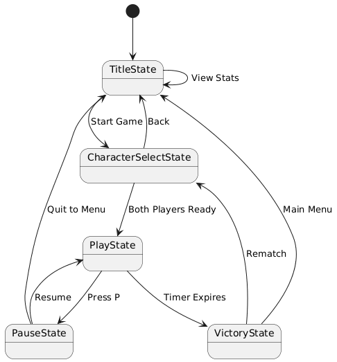

### Player State Diagram

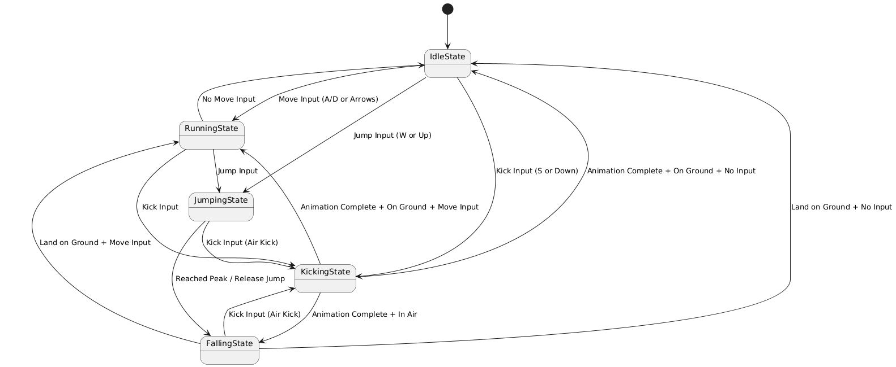

### Ball State Diagram

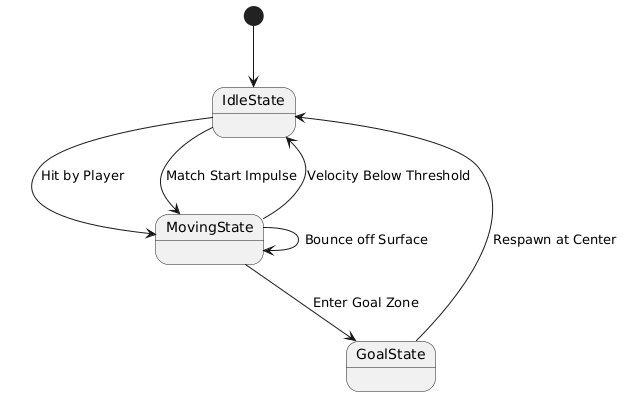

### PowerUp State Diagram

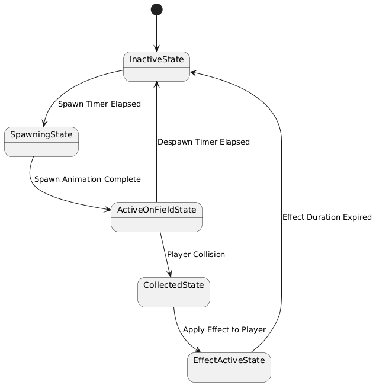

## 🗺️ Class Diagram

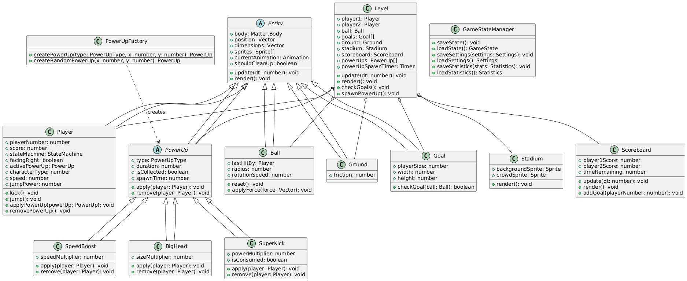

## 🧵 Wireframes

### Title Screen

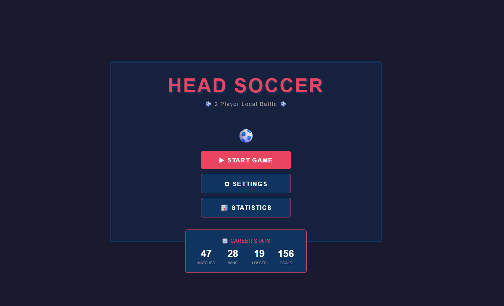

- **START GAME** navigates to the character selection screen.
- **SETTINGS** navigates to the settings screen where players can adjust volume.
- **STATISTICS** displays the player's career stats (matches, wins, losses, goals).
- **Career Stats Box** shows a quick overview of lifetime statistics.

### Character Select Screen

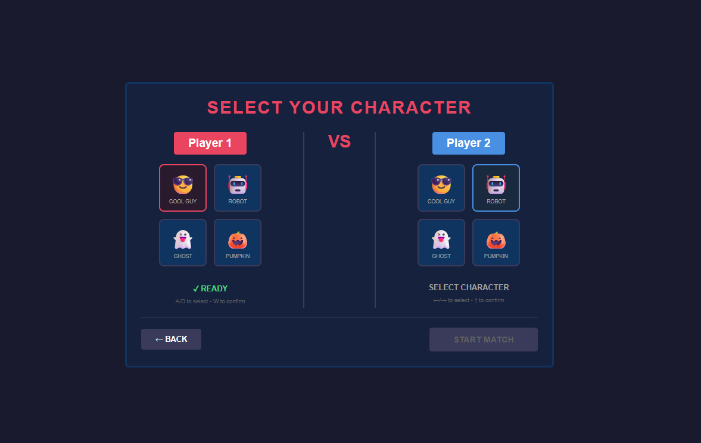

- **Character Cards** allow each player to browse and select their character by highlighting it.
- **READY indicator** shows when a player has confirmed their character selection.
- **BACK button** returns to the title screen.
- **START MATCH button** begins the game once both players are ready (disabled until both confirm).
- **Controls hint** reminds each player which keys to use for selection.

### Game Screen

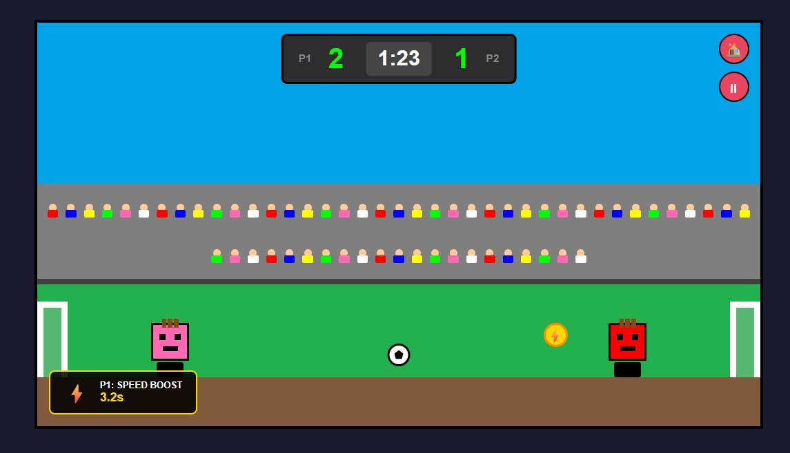

- **Scoreboard** displays both players' current scores and the remaining match time.
- **Home button** opens the pause menu to quit to the main menu.
- **Pause button** pauses the game and opens the pause menu.
- **Power-up indicator** shows the active power-up effect and its remaining duration.
- **Players** are the controllable characters on the field.
- **Ball** is the soccer ball that players hit to score goals.
- **Goals** are the scoring zones on the left and right edges of the field.
- **Power-up pickup** is a collectible item that grants temporary abilities.

### Pause Screen

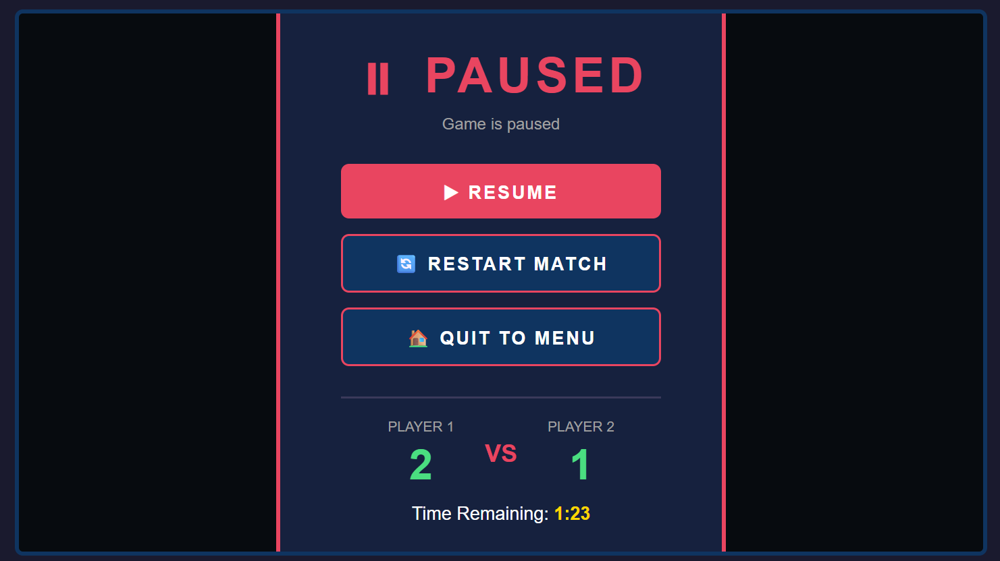

- **RESUME** closes the pause menu and continues the match.
- **RESTART MATCH** ends the current match and starts a new one with the same characters.
- **QUIT TO MENU** ends the current match and returns to the title screen.
- **Current Score display** shows both players' scores and remaining time.

### Victory Screen

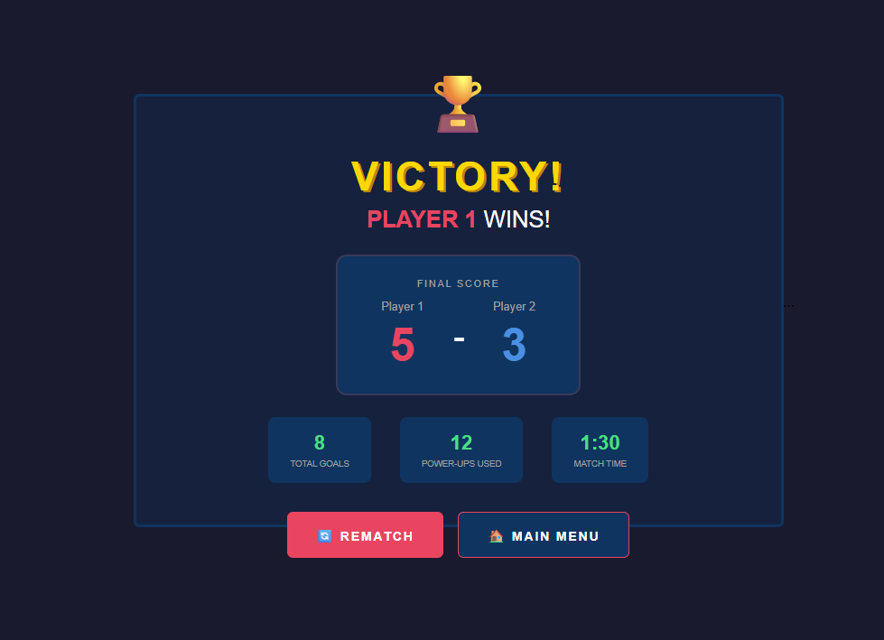

- **Final Score display** shows each player's final goal count.
- **Match Statistics** show total goals, power-ups used, and match duration.
- **REMATCH** starts a new match with the same character selections.
- **MAIN MENU** returns to the title screen.

### Settings Screen

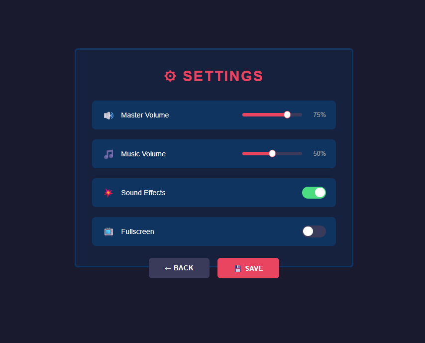

- **Master Volume slider** adjusts the overall game volume.
- **Music Volume slider** adjusts the background music volume independently.
- **Sound Effects toggle** enables or disables all sound effects.
- **Fullscreen toggle** switches between windowed and fullscreen mode.
- **BACK button** returns to the previous screen without saving.
- **SAVE button** saves the current settings and returns to the previous screen.

## 🎨 Assets

### 🖼️ Images

The following sprites and images will be needed:

- **Character Heads**: 4 different character head sprites
- **Boots/Cleats**: Boot sprite for player characters
- **Soccer Ball**: Ball sprite
- **Goals**: Goal net and post sprites
- **Field**: Grass field background with striped pattern
- **Stadium**: Crowd background, stadium lights, fence/banner
- **Power-ups**: 
  - Lightning bolt icon (Speed Boost)
  - Expand/size icon 
  - Fire/flame icon (Super Kick)
- **UI Elements**: Buttons, scoreboard background, timer display

**Sources:**
- [itch.io Game Sprites](https://itch.io/game-assets/free)
- [Head Soccer Sprites](https://develion.itch.io/head-ball) 
- [Powerup Sprites](https://youngyokai.itch.io/simple-rpg-skill-icons-free)

### ✏️ Fonts

- [**"Press Start 2P"**](https://fonts.google.com/specimen/Press+Start+2P) - Retro pixel font for title and headings - 
- [**"Roboto"**](https://fonts.google.com/specimen/Roboto) - Clean sans-serif for UI text and scores
- [**"Bebas Neue"**](https://fonts.google.com/specimen/Bebas+Neue) - Bold condensed font for timer display

**Sources:**
- [Google Fonts](https://fonts.google.com/)

### 🔊 Sounds

- **Background Music**: Upbeat sports/arcade theme
- **Kick Sound**: Impact sound when player kicks ball
- **Ball Bounce**: Bounce sound when ball hits surfaces
- **Goal Scored**: Crowd cheer and goal horn
- **Whistle**: Match start and end whistle
- **Jump Sound**: Whoosh effect for player jumps
- **Power-up Spawn**: Magical appearance sound
- **Power-up Collect**: Pickup/collection sound
- **Power-up Active**: Subtle ambient sound while power-up is active
- **Menu Navigation**: Button click sounds
- **Victory Jingle**: Celebratory short melody

**Sources:**
- [freesound.org](https://freesound.org/) - Free sound effects
- [Crowd Cheering](https://freesound.org/people/GregorQuendel/sounds/481780/)
- [Bouncing Ball](https://freesound.org/people/freesoundMozardes/sounds/514640/)
- [Whistle](https://freesound.org/people/SpliceSound/sounds/218318/)
- [Victory Jingle](https://freesound.org/people/Rolly-SFX/sounds/626259/)

## 📚 References

- [Head Soccer Games](https://www.crazygames.com/game/head-soccer) - Gameplay inspiration